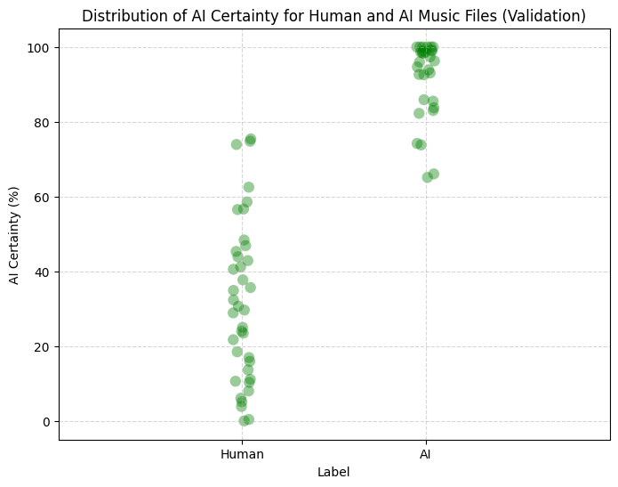

A machine learning model that determines if a song was generated with AI.

Chops the song into 1-second segments then feeds each segment to a TensorFlow/Keras sequential model with 5 convolutional blocks.
Final certainty for a song is determined by dividing segments evaluated as "AI" by the total number of segments in the song.

Instructions: Set the LOAD_MODEL flag to True to load the 21Jan2025.h5 file. Add cells at the end calling evaluate_indepdent_file to evaluate your own music files. Run all cells.

Validation statistics:
